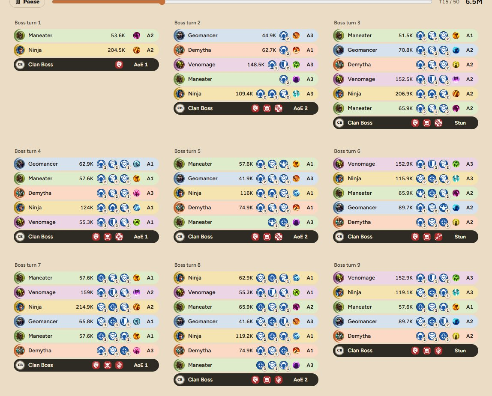
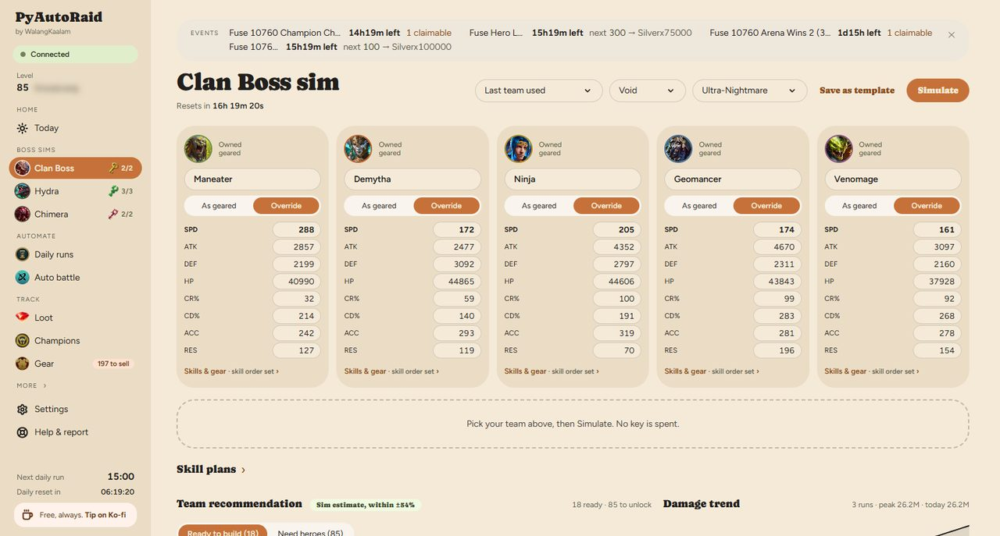
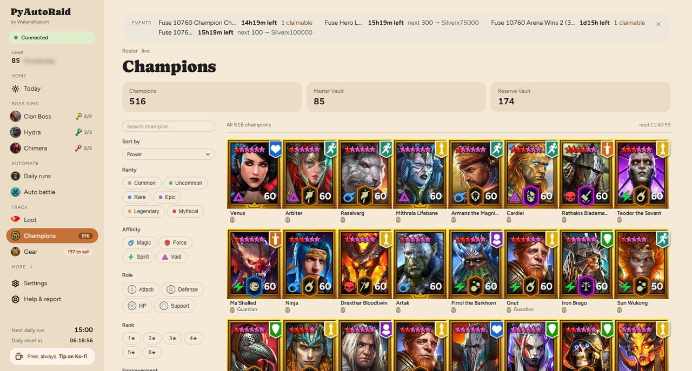

<h1>PyAutoRaid</h1>

<h3>See your real Clan Boss fight before you spend a key.</h3>

A free companion app for <strong>Raid: Shadow Legends</strong> that plays out your boss fights
on the game's own engine, organises your roster and vault, and runs entirely on your computer.

<a href="https://snooplawg.github.io/PyAutoRaid/"><b> Website — downloads, a tour of every page, and how it works →</b></a>

<a href="https://snooplawg.github.io/PyAutoRaid/#download"><b> Download for Windows or Mac</b></a> &nbsp;·&nbsp;
<a href="https://discord.gg/E8qf7y8sc6"> Discord</a> &nbsp;·&nbsp;
<a href="https://youtube.com/@walangkaalam"> YouTube</a>

Free · Windows 10/11 and macOS · In beta · by <a href="https://youtube.com/@walangkaalam">WalangKaalam</a>

---

 A full Clan Boss fight, turn by turn — with zero keys spent.

## What it does

-  **Clan Boss sim** — pick five champions, the affinity and the difficulty, and watch the
  whole fight on the game's own battle engine: every hit, buff, debuff and stun, and the total
  damage. Prove a tune, a re-gear or a new champion before it costs a key.
-  **Hydra &amp; Chimera sims** — see which chest tier a team actually reaches.
-  **Champions &amp; Gear** — your roster in the game's own card art, and a vault cleanse
  where you set the Keep/Sell rules and review every piece before anything is sold.
-  **One place for the daily grind** — loot, quests, events, arena and summon mercy.
-  **Automation, if you want it** — farm a stage or run your dailies on a timer. Off unless
  you turn it on; the sims work without it.

** [See all sixteen pages on the website →](https://snooplawg.github.io/PyAutoRaid/#tour)**

---

## Download

| | Platform | File |
|---|---|---|
|  | **Windows 10 / 11** | `PyAutoRaid-Setup-<version>.exe` — run the installer |
|  | **macOS** (Apple Silicon &amp; Intel) | `PyAutoRaid-<version>-mac.dmg` — drag PyAutoRaid into Applications |

** [Download from the website →](https://snooplawg.github.io/PyAutoRaid/#download)**

On first launch a short setup walks you through everything — adding the mod to your own copy
of Raid, connecting to it, and copying the game's pictures from your install. No terminal,
no Python, nothing else to install. On Windows it keeps itself up to date; on a Mac, download the new version from here when one comes out.

> **Mac — the first time you open it.** PyAutoRaid isn't registered with Apple yet, so your
> Mac blocks the first launch. Press **Done** on the warning, open **System Settings ›
> Privacy &amp; Security**, scroll down, click **Open Anyway** next to "PyAutoRaid was
> blocked", and enter your password. After that it opens like any other app.

---

## How it works

A small mod loads with Raid on your computer and gives PyAutoRaid a private, local connection
to the game.

- **The game's own engine.** The sims run the same battle code the game does, so what you see
  is how the fight plays.
- **No screen automation.** Everything goes through the game's own data — never fake clicks
  or screen reading.
- **Your data stays with you.** Your account, roster and gear stay on your computer.
  Anonymous battle stats (teams, speeds, results — never account details) are shared to build
  community insights; this is on by default and can be turned off. See the [EULA](./EULA.md).
- **Nothing of Plarium's is shipped.** Game art is copied from your own install.

---

##  Use at your own risk

PyAutoRaid is a **fan-made, unofficial tool**, **not affiliated with or endorsed by Plarium**.
*Raid: Shadow Legends* and all related names and art belong to Plarium. Modding or automating a
game may break its Terms of Service and could put your account at risk — you use PyAutoRaid
entirely at your own risk. Use is governed by the [EULA](./EULA.md).

---

## Free — support welcome

PyAutoRaid is **free** — no paywall, no premium tier, and donations never unlock anything.
If it saves you keys and you'd like to help:
 [Patreon](https://www.patreon.com/cw/WalangKaalam/membership) ·  [Ko-fi](https://ko-fi.com/walangkaalam)

Help, bug reports and tune sharing happen on the [**Discord**](https://discord.gg/E8qf7y8sc6).
This repository hosts the website and the downloads; the app itself is closed-source.

PyAutoRaid by WalangKaalam · Not affiliated with Plarium · Raid: Shadow Legends © Plarium

